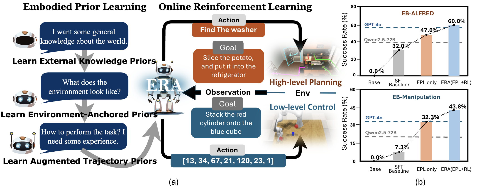

<h1 align="center">
  <!--  -->
  ERA: Transforming VLMs into Embodied Agents via Embodied Prior Learning and Online Reinforcement Learning
</h1>

<p align="center">
  <!-- 📄 <a href="http://arxiv.org/abs/2502.xxxxx"><strong>Paper</strong></a> | -->
  🤗 <a href="https://huggingface.co/EmbodiedReasoningAgent"><strong>Dataset</strong></a> |
  🏠 <a href="https://embodied-reasoning-agent.github.io"><strong>Project Website</strong></a>
</p>

<p align="center">
  <a href="">Hanyang Chen*</a>,
  <a href="">Mark Zhao*</a>,
  <a href="">Rui Yang*</a>,
  <a href="">Qinwei Ma</a>,
  <a href="">Ke Yang</a>,
  <a href="">Jiarui Yao</a>,
  <a href="">Kangrui Wang</a>,
  <a href="">Hao Bai</a>,
  <a href="">Zhenhailong Wang</a>,
  <a href="">Rui Pan</a>,
  <a href="">Mengchao Zhang</a>,
  <a href="">Jose Barreiros</a>,
  <a href="">Aykut Onol</a>,
  <a href="">ChengXiang Zhai</a>,
  <a href="">Heng Ji</a>,
  <a href="">Manling Li</a>,
  <a href="">Huan Zhang</a>,
  <a href="">Tong Zhang</a>
</p>

<p align="center">
  <sup>1</sup>University of Illinois Urbana-Champaign, 
  <sup>2</sup>Northwestern University, 
  <sup>3</sup>Toyota Research Institute
</p>

<p align="center">
  
</p>

# 🖥️ Setup
Download repo
```bash
git clone git@github.com:Embodied-Reasoning-Agent/Embodied-Reasoning-Agent.git
cd Embodied-Reasoning-Agent
```

1️⃣ Environment for ```Embodied Prior Learning (EPL)```
```bash
cd ERA-sft
conda env create -f environment.yaml 
conda activate era-epl-env
```
# Dataset Preparation

1. **Environment-Anchored Prior Dataset**
   - Download the dataset from [EB-Man_environment_anchored_prior_dataset](https://huggingface.co/datasets/EmbodiedReasoningAgent/EB-Man_environment_anchored_prior_dataset) and [EB-ALFRED_environment_anchored_prior_dataset](https://huggingface.co/datasets/EmbodiedReasoningAgent/EB-ALFRED_environment_anchored_prior_dataset)

2. **External Knowledge Prior Dataset**
   - Download the dataset from [EB-Man_external_knowledge_prior_dataset](https://huggingface.co/datasets/EmbodiedReasoningAgent/EB-Man_external_knowledge_prior_dataset) and [EB-ALFRED_external_knowledge_prior_dataset](https://huggingface.co/datasets/EmbodiedReasoningAgent/EB-ALFRED_external_knowledge_prior_dataset)

Note: Place either the environment-anchored prior data or the external knowledge prior data according to the structure defined in [`ERA-sft/epl/data/stage1.yaml`](./ERA-sft/epl/data/stage1.yaml)

3. **Trajectory-Augmented Prior Dataset**
   - Download the dataset from [EB-Man_trajectory_augmented_prior_dataset](https://huggingface.co/datasets/EmbodiedReasoningAgent/EB-Man_trajectory_augmented_prior_dataset) and [EB-ALFRED_trajectory_augmented_prior_dataset](https://huggingface.co/datasets/EmbodiedReasoningAgent/EB-ALFRED_trajectory_augmented_prior_dataset)
   - Place the data according to the structure defined in [`ERA-sft/epl/data/stage2.yaml`](./ERA-sft/epl/data/stage2.yaml)

# Embodied Prior Learning Training 

1. Configure your training settings:
```bash
cd epl
```

   - Open `scripts/train.sh`
   - Set the `SFT_TASK` variable to specify your training stage
   - Set the `SAVE_DIR` variable to specify path to your saving directory
   - Set the `IMAGE_FOLDER` variable to specify path to your image folder

3. Start training:
```bash
bash scripts/train.sh
```


